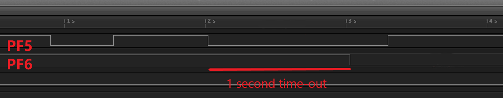

<!-- Please do not change this html logo with link -->

# Timer Counter Type B (TCB) in Three Different Modes Using the AVR64DD32 Microcontroller

 The repository contains three MPLAB® X projects:

 1.  [TCB in 8-bit PWM Mode](#1-tcb-in-8-bit-pwm-mode) – This code example shows how to configure the TCB peripheral to obtain a Pulse-Width Modulation (PWM) signal with a 50% duty cycle and one second period.
 2.  [TCB in Sleep Mode](#2-tcb-in-sleep-mode) – This code example configures the TCB peripheral to operate in Sleep mode with an overflow interrupt on every second.
 3.  [TCB in Time-out Check Mode](#3-tcb-in-time-out-check-mode) – This code example uses the TCB peripheral in Time-out Check mode and measures the signal time generated by a General Purpose Input/Output (GPIO).

## Related Documentation

More details and code examples on the AVR64DD32 can be found at the following links:

- [AVR64DD32 Product Page](https://www.microchip.com/wwwproducts/en/AVR64DD32)
- [AVR64DD32 Code Examples on GitHub](https://github.com/microchip-pic-avr-examples?q=AVR64DD32)
- [AVR64DD32 Project Examples in START](https://start.atmel.com/#examples/AVR64DD32CuriosityNano)

## Software Used

- [MPLAB® X IDE](http://www.microchip.com/mplab/mplab-x-ide) v6.00 or newer
- [MPLAB® XC8](http://www.microchip.com/mplab/compilers) v2.36 or newer
- [AVR-Dx Series Device Pack](https://packs.download.microchip.com/) v2.1.152 or newer

## Hardware Used

- The AVR64DD32 Curiosity Nano Development board is used as a test platform
   

## Operation

To program the Curiosity Nano board with this MPLAB® X project, follow the steps provided in the [How to Program the Curiosity Nano Board](#how-to-program-the-curiosity-nano-board) chapter.  

## 1. TCB in 8-bit PWM Mode

This code example shows how to configure the TCB to generate a PWM signal with a period of 1 second and 50% duty cycle and to how output it on a pin.

### 1.1 Setup

The following configurations must be made for this project:

- System clock is set to Internal 32.768 kHz oscillator (Ultra Low-Power)
  - Prescaler is set to 64x
- TCB0 configuration:
  - Clock Selection: Main clock divided by 2 (CLK_PER/2), input clock to TCB is 256 Hz
  - The PWM signal period is controlled by the CCMPL, while the CCMPH controls the duty cycle of the waveform
  - TCB configured in 8-bit PWM mode
  - TCB output on external pin enabled (PA2)

| Pin | Configuration  |
| :-: | :------------: |
| PA2 | Digital output |

### 1.2 Demo

Connect a Logic Analyzer to pin PA2 on the AVR64DD32 Curiosity Nano board and check the signal:
 

This image shows the PWM signal generated by the TCB0 instance. The waveform period is 1 second and its duty cycle is 50%.

### 1.3 Summary

This code example shows how to configure the TCB peripheral in 8-bit PWM mode to generate a PWM signal with a period of 1 second and 50% duty cycle.  
[Back to top](#timer-counter-type-b-tcb-in-three-different-modes-using-the-avr64dd32-microcontroller) 

## 2. TCB in Sleep Mode

This code example shows how to configure the TCB to operate in Sleep mode. The TCB0 is configured to generate an overflow interrupt every second. The interrupt wakes up the device and toggles the on-board LED (PF5).

### 2.1 Setup

The following configurations must be made for this project:

- System clock is set to Internal 32.768 kHz oscillator (Ultra Low-Power) and the Prescaler is off
- TCB0 configuration:
  - Clock Selection: Main clock is equal to system clock, 32768 Hz
  - The CCMP register is configured for 1 second period
  - TCB configured in Periodic Interrupt mode
  - Capture or time-out interrupt enabled
  - Run in Standby enabled

Sleep is enabled and set to Standby mode.

Pin PF5 is configured as output, having the initial state HIGH (for the LED to start off).

| Pin |     Configuration     |
| :-: | :-------------------: |
| PF5 | Digital output (LED0) |

### 2.2 Demo

Connect a Logic Analyzer to pin PF5 on the AVR64DD32 Curiosity Nano board and check the signal:
 

This image shows the LED pin toggling every second. The core exits the Sleep mode, toggles the LED, and enters the Sleep mode once again.

### 2.3 Summary

This code example shows how to configure the TCB peripheral to provide an interrupt every second to wake up the microcontroller from Standby Sleep mode and toggle an LED.  
[Back to top](#timer-counter-type-b-tcb-in-three-different-modes-using-the-avr64dd32-microcontroller) 

## 3. TCB in Time-out Check Mode

This program shows how to configure the TCB in Time-out Check mode and measure the signal read from a GPIO pin. The time-out will be set to 1 second. If the time-out period is reached, the on-board LED (PF5) will toggle.

### 3.1 Setup

The following configurations must be made for this project:

- System clock is set to Internal 32.768 kHz Oscillator (Ultra Low-Power) and the Prescaler is off
- TCB0:
  - Clock Selection: Main clock divided by 1
  - Time-out in CCMP register set to 1 second
  - TCB configured in Periodic Time-out mode
  - Capture or time-out interrupt enabled
  - Event input for capture is enabled and the Edge-bit is set
- Event System
  - Pin PF6 (on-board button on the Curiosity Nano Development board) as the event generator on channel 5
  - Event user TCB0 capture is set to channel 5

Pin PF5 is configured as output, having the initial state HIGH (for the LED to start off) and pin PF6 is configured as input with pull up.

| Pin |     Configuration      |
| :-: | :--------------------: |
| PF5 | Digital output (LED0)  |
| PF6 | Digital input (Button) |

### 3.2 Demo

Connect a Logic Analyzer to pins PF5 and PF6 on the AVR64DD32 Curiosity Nano board and check the signals:
  

This image shows the button signal on pin PF6 and the LED on PF5. Note that the LED toggles when the button press is longer than a second.

### 3.3 Summary

This program shows how to configure the TCB peripheral in Time-out Check mode and measure the signal time generated by a GPIO pin.  
[Back to top](#timer-counter-type-b-tcb-in-three-different-modes-using-the-avr64dd32-microcontroller) 

## How to Program the Curiosity Nano Board

This chapter shows how to use the MPLAB® X IDE to program an AVR® device with an Example_Project.X. This can be applied to any other projects.

- Connect the board to the PC

- Open the Example_Project.X project in MPLAB® X IDE

- Set the Example_Project.X project as main project

  - Right click the project in the **Projects** tab and click **Set as Main Project**
     

- Clean and build the Example_Project.X project

  - Right click the **Example_Project.X** project and select **Clean and Build**
     

- Select **AVRxxxxx Curiosity Nano** in the Connected Hardware Tool section of the project settings:

  - Right click the project and click **Properties**
  - Click the arrow under the Connected Hardware Tool
  - Select **AVRxxxxx Curiosity Nano** (click the **SN**), click **Apply** and then click **OK**:
     

- Program the project to the board
  - Right click the project and click **Make and Program Device**
     

 

- [Back to 1. TCB in 8-bit PWM Mode](#1-tcb-in-8-bit-pwm-mode)
- [Back to 2. TCB in Sleep Mode](#2-tcb-in-sleep-mode)
- [Back to 3. TCB in Time-out Check Mode](#3-tcb-in-time-out-check-mode)
- [Back to top](#timer-counter-type-b-tcb-in-three-different-modes-using-the-avr64dd32-microcontroller)
